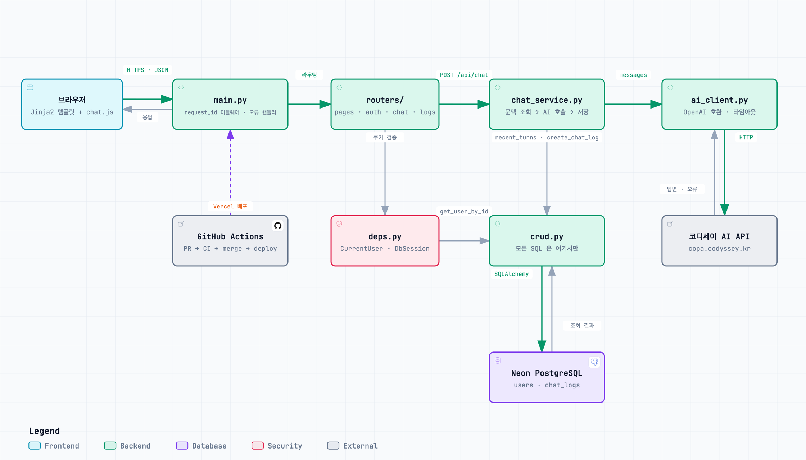
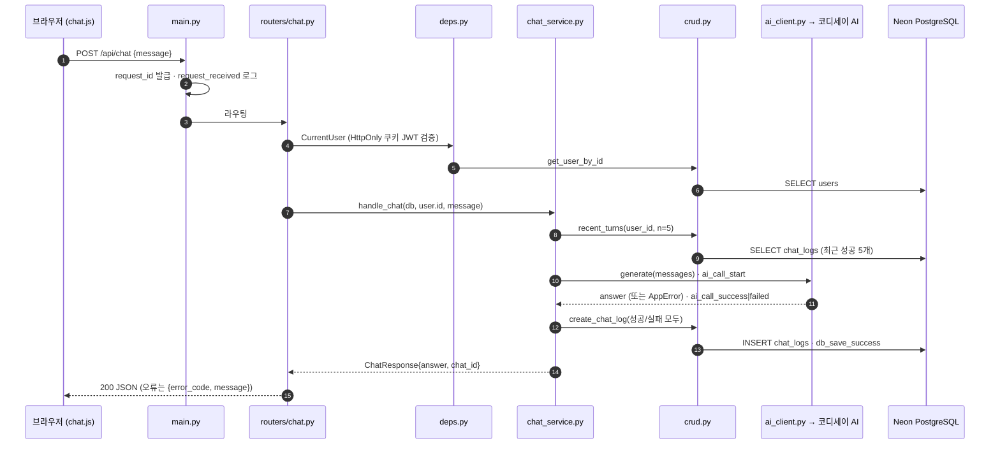

# 코딩 학습 Q&A 도우미

로그인한 학습자가 언제든 코딩 질문을 던지고, 직전 대화의 문맥을 이어 답을 받는 웹 챗봇.
대화는 전부 DB에 남겨 나중에 되짚어 볼 수 있게 한다.

**서비스 URL — https://b7-ai-chatbot.vercel.app**

---

## 1. 개요

<!-- 담당 임대균 — 문제 정의 · 타겟 사용자 · 핵심 시나리오 (평가항목 1) -->

코딩 학습 Q&A 도우미는 컴퓨터공학을 공부하거나 프로그래밍을 배우는 사람이
개념, 코드, 오류 메시지를 질문하고 답변을 받을 수 있는 웹 챗봇이다.
브라우저에서 회원가입하고 로그인하면 사용할 수 있다.

### 어떤 문제를 해결하려고 했나

코딩을 공부하다 막히면 오류 메시지의 뜻뿐 아니라, 내가 작성한 코드에서 왜 문제가
생겼는지 알고 싶을 때가 많다. 답변을 읽고도 이해가 되지 않는 부분은 다시 물어봐야 하고,
나중에 같은 문제를 만나면 이전에 어떤 설명을 들었는지 찾아볼 필요도 있다.

이 서비스는 질문과 추가 질문을 이어서 할 수 있고, 지난 질문과 답변을 다시 확인할 수
있도록 만들었다. 학습자는 대화 기록을 복습에 활용하고, 운영자는 요청·AI 호출·DB 저장
기록을 통해 문제가 어느 단계에서 생겼는지 확인할 수 있다.

### 누가 사용하나

- CS 개념이나 알고리즘을 공부하면서 이해되지 않는 내용을 물어보고 싶은 학생
- 직접 작성한 코드와 오류 메시지를 놓고 원인을 살펴보고 싶은 프로그래밍 입문자
- 앞서 받은 답변에 이어 질문하거나, 지난 질문과 답변을 다시 확인하고 싶은 학습자

### 어떻게 사용하나

1. 아이디와 비밀번호로 회원가입한 뒤 로그인한다.
2. 질문 화면에 궁금한 개념, 코드 또는 오류 메시지를 입력한다. 예를 들어 오류가 난
   파이썬 코드와 `IndexError` 메시지를 함께 붙여넣고 원인을 물어볼 수 있다.
3. 서버가 AI에 질문을 전달하고, 받은 답변을 화면에 보여준다. 답변을 기다리는 동안에는
   처리 중이라는 안내가 표시된다.
4. 설명이 더 필요하면 이어서 질문한다. 서버는 같은 사용자의 최근 성공한 대화를 최대 5개까지
   함께 전달해, 앞서 주고받은 내용을 답변에 참고하도록 한다.
5. 저장된 질문과 답변은 ‘지난 대화’ 화면에서 최근 순서로 확인한다. 자신의 기록만 볼 수
   있으며, 사용을 마치면 로그아웃한다.

채팅과 대화 기록 조회는 로그인한 사용자에게 제공한다. 빈 질문을 보내거나 AI 요청이
실패하면 화면에 이유를 안내한다. AI 답변은 학습을 돕는 참고 자료로 사용하고, 제시된
코드나 설명은 직접 실행하거나 공식 문서와 대조해 확인하는 것이 좋다.

## 2. 기술 스택

| 구분 | 선택 | 비고 |
|---|---|---|
| 언어 · 프레임워크 | Python 3.12 · FastAPI | 과제 지정 |
| 화면 | Jinja2 서버 템플릿 + 채팅 송수신만 `fetch` | 새로고침 없이 대화 유지 |
| DB | Neon PostgreSQL · SQLAlchemy 2.x · psycopg 3 | pooled 연결, development·production 분리 |
| 인증 | JWT + HttpOnly 쿠키 (라이브러리 사용) | |
| AI | 9/1 확정 | 타임아웃 10초 |
| 배포 | Vercel (GitHub Actions에서 CLI 배포) | |

DB 제공자는 **Neon Free**로 확정하고 두 브랜치의 pooled 연결 문자열을 임익화에게 비공개 전달했다.
유휴 상태에서 연결 시 자동 기동하고, pooled 엔드포인트를 제공하므로 이 서비스에 선택했다.
근거: [연결·자동 기동 안내](https://neon.com/docs/connect/connection-errors),
[연결 풀링 안내](https://neon.com/docs/connect/connection-pooling).

2026-09-12 확인한 [공식 Free 요금표](https://neon.com/pricing): 프로젝트당 저장 공간 0.5 GB,
컴퓨트 월 100 CU-hours, 복원 이력은 최대 6시간 또는 변경 데이터 1 GB 한도다.
복원 이력 창은 대화 행의 자동 삭제 주기가 아니다. 요금·한도는 변할 수 있으므로 시연 전 임익화가
콘솔의 실제 플랜·사용량과 development 브랜치의 자동 삭제 설정을 다시 확인한다.

## 3. 시스템 구조



> 위 그림은 [archify](https://github.com/tt-a1i/archify) 로 코드에서 그린 것이다. 원본 명세는
> [`docs/architecture/architecture.archify.json`](docs/architecture/architecture.archify.json),
> 상호작용 버전(경로 추적·검색·PNG/SVG 내보내기)은 [`docs/architecture/architecture.html`](docs/architecture/architecture.html) 을
> 브라우저로 열면 된다. 구조가 바뀌면 JSON 을 고치고 `archify deliver` 로 다시 뽑는다.

앱 전체가 **Vercel 서버리스 함수 하나**다. 브라우저의 요청은 `main.py` 의 request_id 미들웨어를 지나
라우터로 가고, 인증(`deps.py`)·쿼리(`crud.py`)·AI 호출(`ai_client.py`)은 각각 한 곳에서만 일어난다.
DB(Neon PostgreSQL)와 AI API 는 함수 밖에 있다.

### 질문 한 번의 흐름 — `POST /api/chat`



서버 로그 4줄(`request_received` → `ai_call_start` → `ai_call_success|failed` → `db_save_success|failed`)과
`chat_logs.request_id` 가 같은 값을 써서, 요청 하나를 로그와 DB 양쪽에서 추적할 수 있다.

| 계층 | 책임 | 해서는 안 되는 것 |
|---|---|---|
| `routers/` | 요청 검증 후 서비스로 전달. HTTP 통역 | SQL 직접 실행, AI SDK 직접 호출 |
| `services/` | 컨텍스트 구성, AI 호출, 파이프라인 제어 | HTTP 상태코드·Request 객체 다루기 |
| `crud.py` | DB 접근 전담. 모든 쿼리가 여기를 통과 | 비즈니스 판단, 예외를 HTTP로 변환 |
| `deps.py` | 인증·DB 세션을 모든 라우터가 재사용 | 라우터마다 쿠키 파싱 복붙 |
| `schemas.py` | 요청/응답 형식을 한 곳에서 정의 | 라우터에서 dict 즉석 조립 |

**DB가 함수 밖에 있는 것이 이 구조의 핵심이다.** Vercel 함수는 파일시스템이 읽기 전용이고
`/tmp` 도 호출 간 잔존이 보장되지 않아 SQLite 파일 DB를 쓸 수 없다.

## 4. 실행 방법

```bash
git clone https://github.com/Teamb7-1/ai-chatbot-service.git
cd ai-chatbot-service

python3 -m venv .venv
./.venv/bin/pip install -r requirements.txt

cp .env.example .env        # 값을 채운다 (아래 5절)
./.venv/bin/uvicorn app.main:app --reload --env-file .env
```

| 확인 | URL |
|---|---|
| 헬스체크 | http://localhost:8000/healthz → `{"status":"ok"}` |
| 자동 API 문서 | http://localhost:8000/docs |

테스트·린트:

```bash
./.venv/bin/pip install ruff pytest httpx
./.venv/bin/ruff check .
./.venv/bin/pytest -q
```

### 배포

배포는 GitHub Actions 가 Vercel CLI 로 수행한다. 사람이 누르는 건 프로덕션 릴리스 하나뿐이다.

| 환경 | 트리거 | 워크플로 | URL |
|---|---|---|---|
| 스테이징 | `develop` 에 머지되면 자동 | `deploy-dev.yml` | https://b7-ai-chatbot-dev.vercel.app |
| 프로덕션 | `gh workflow run release.yml` | `release.yml` → `main` 머지 → `deploy.yml` | https://b7-ai-chatbot.vercel.app |

`vercel.json` 이 `app/main.py` 를 단일 서버리스 함수(`maxDuration: 60`)로 지정한다.
환경 변수는 Vercel 프로젝트에 둔다(5절) — `scripts/vercel-env-push.sh` 가 `.env.local` 을 읽어
production·preview 양쪽에 등록하고, 스테이징은 `.env.preview` 로 다른 DB 를 본다.

처음부터 재현하려면 GitHub 리포 시크릿 넷이 필요하다:

| 시크릿 | 용도 |
|---|---|
| `VERCEL_TOKEN` `VERCEL_ORG_ID` `VERCEL_PROJECT_ID` | Actions 가 Vercel 에 배포 |
| `GH_PAT` | 자동 PR·머지가 후속 워크플로를 깨우게 (기본 토큰은 못 깨운다) |

## 5. 환경 변수

`.env.example` 을 복사해 사용한다. **실제 값은 리포에 커밋하지 않는다** — 공개 저장소다.

| 이름 | 설명 |
|---|---|
| `SECRET_KEY` | JWT 서명 키. `python -c "import secrets;print(secrets.token_hex(32))"` |
| `DATABASE_URL` | Neon PostgreSQL 의 **pooled** 엔드포인트 (`postgresql+psycopg://…?sslmode=require`) |
| `AI_API_KEY` | 코디세이 OpenAI 호환 엔드포인트 키 |
| `AI_TIMEOUT_SECONDS` | AI 호출 타임아웃 (기본 10) |

환경변수에 두는 기준: **비밀이거나, 환경마다 달라야 하거나, 운영 중 값을 바꿔야 하는 것.**
그 셋에 해당하지 않는 값(모델명·문맥 턴 수·엔드포인트 URL)은 `app/config.py` 상수다 —
환경변수 하나는 스테이징에 빠뜨릴 수 있는 곳 하나다.

배포 환경의 값은 **Vercel 대시보드 환경변수**에만 저장한다. Hobby 플랜이라 접근이
계정 소유자로 제한되므로 변경이 필요하면 임익화에게 요청한다.

## 6. API 명세

<!-- 담당 손재현 — 요청/응답 예시 포함 (평가항목 3) -->
> 작성 예정

## 7. DB 구조

<!-- 담당 최건영 — 테이블·필드 또는 ERD (평가항목 4) -->

`users`(임대균)와 `chat_logs`(최건영)는 사용자 1명 대 대화 여러 건의 관계다.
`chat_logs.user_id`가 `users.id`를 참조한다. 전체 필드·제약·인덱스는 [ERD 문서](docs/ERD.md)에 정리했다.

대화 테이블은 `id`, `user_id`, `request_id`, `question`, `answer`, `status`,
`error_code`, `provider`, `model`, `latency_ms`, `created_at`의 11개 컬럼이다.
질문·답변 원문뿐 아니라 성공 여부, 오류 코드, 제공자·모델, 소요 시간을 함께 저장한다.
`request_id`로 서버 로그와 DB 기록을 연결해 어느 요청에서 실패했는지 추적한다.

DB 접근은 동기 SQLAlchemy `Session`과 `app/crud.py`로 통일한다.

- `create_chat_log`: 성공·실패 기록을 저장하고 commit. DB 오류는 rollback 후 전파한다.
- `recent_turns`: 자신의 최근 성공 5개(설정 상수)를 선택해 과거 → 현재 순서로 반환한다.
- `list_chat_logs`: 자신의 성공·실패 기록을 최신순으로 반환한다. 기본 `limit=20`, `offset=0`.

ORM 객체의 `id`는 `chat_id` 속성을 통해 API의 `ChatLogItem`으로 변환한다.
`GET /api/me/chats`는 로그인한 사용자 ID만 사용한다. URL의 `user_id`로 남의 기록을 요청할 수 없다.
API·화면 등록은 임익화의 `main.py`·`routers/pages.py` 연동이 필요하다.

## 8. DB 확인 방법

<!-- 담당 최건영 — 평가자가 직접 조회하는 절차 (평가항목 5) -->

### 테이블 초기화 — 임익화가 두 브랜치에 각각 실행

1. 최신 코드를 받고 의존성을 설치한다. Neon 콘솔에서 대상이 **development**인지 확인한다.
2. 해당 브랜치의 `DATABASE_URL`을 실행 프로세스에 안전하게 주입한다.
   값은 `postgresql+psycopg://` 형식이고 pooled 호스트·TLS 옵션을 유지한다.
   실제 URL을 소스·이슈·터미널 캡처에 붙이지 않는다. 스크립트는 `.env`를 자동으로 읽지 않는다.
3. 리포 루트에서 실행한다. 가상환경 활성화 후:

   ```bash
   python -m scripts.create_tables --confirm
   ```

   Windows에서 가상환경을 활성화하지 않았다면:

   ```powershell
   .\.venv\Scripts\python.exe -m scripts.create_tables --confirm
   ```

4. 성공 메시지와 종료 코드 0을 확인한다. 실패는 종료 코드 1이며 DB 주소·비밀번호는 출력하지 않는다.
   `--confirm` 없이는 실행되지 않는다. 연결·설정·권한 오류가 있으면 해결 후 재실행한다.
5. **production** 연결 정보로 바꿔 대상 브랜치를 다시 확인하고 동일 명령을 실행한다.

`Base.metadata.create_all(checkfirst=True)`로 없는 테이블을 생성한다.
development에 이미 있는 `users`와 기존 데이터를 유지한다. 데이터 삭제·초기 데이터 삽입은 하지 않는다.
기존 테이블 구조를 수정하는 기능은 없으므로 컬럼 변경 시 별도 마이그레이션이 필요하다.
앱 시작 훅이나 자동 배포 과정에서 이 명령을 실행하지 않는다.

### SQL 확인과 증빙

Neon 콘솔에서 대상 브랜치·DB를 선택한 뒤 **SQL Editor**에
[`scripts/check_logs.sql`](scripts/check_logs.sql)을 붙여 넣어 실행한다.
`psql`을 사용한다면 `PGHOST`, `PGDATABASE`, `PGUSER`, `PGPASSWORD`, `PGSSLMODE` 등
접속 설정을 안전하게 주입한 상태에서 실행한다. SQLAlchemy 전용 `+psycopg` URL을 psql에 넣지 않는다.

```bash
psql -X -v ON_ERROR_STOP=1 -f scripts/check_logs.sql
```

SQL은 테이블 존재, 11개 컬럼, 최근 기록, 사용자별 성공·실패 건수,
최근 성공 5건, 특정 대화 보존 여부를 조회한다. 마지막 두 조회의 `0`은 시연용 `user_id`와
확인하려는 `chat_id`로 각각 바꾼다. 데이터 변경 SQL은 포함하지 않는다.
질문·답변이 없는 초기 DB는 빈 결과가 정상이며, 그것만으로 대화 저장이 검증된 것은 아니다.

검증 순서(임익화·손재현 연동 후):

1. 임익화가 `logs.router`를 앱에 등록하고 `/logs` 화면을 실제 CRUD에 연결한다.
2. 시연계정 1로 로그인해 질문하고, SQL의 `chat_id`, `request_id`, 질문·답변·시각을 기록한다.
3. 브라우저에서 `/api/me/chats?limit=20&offset=0`과 `/logs`를 열어 자신의 기록을 확인한다.
4. 시연계정 2에서는 시연계정 1의 기록이 보이지 않는지, 비로그인은 API 401인지 확인한다.
5. 임익화가 **같은 환경으로 재배포**한 후, 같은 브랜치에서 기록한 `chat_id`를 재조회한다.
   이전 질문·답변·시각이 그대로 남아 있어야 한다. development와 production을 서로 비교하지 않는다.
6. 브랜치명·확인 시각·배포 커밋·조회 결과를 캡처한다. DB 비밀번호, 키, 쿠키,
   실제 사용자의 개인정보는 포함하지 않고 시연용 가상 데이터만 사용한다.

### 검증 상태와 로컬 테스트

아래 실제 환경 항목은 **실행 후 증빙을 붙일 때만** 완료 표시한다.

2026-09-12 로컬 검증: 임시 PostgreSQL 17.11을 이용해 전체 테스트 **168개 통과**
(실제 DB 테스트 17개 포함), `ruff check .` 통과. 기존 Starlette 의존성의
DeprecationWarning 1건이 있다. 이 결과는 실제 Neon·배포 환경 검증을 대체하지 않는다.

- [ ] 임익화: 두 Neon 브랜치의 `users`·`chat_logs` 생성 확인
- [ ] 임익화: API 라우터 등록 및 `/logs` 화면 연결
- [ ] 손재현·임익화·최건영: 실제 질문 → AI 응답 → DB 저장 → 본인 기록 조회
- [ ] 최건영·임익화: SQL 콘솔 실행 결과 캡처
- [ ] 최건영·임익화: 재배포 전후 동일 대화 보존 캡처

```bash
python -m pytest -q
```

실제 DB 테스트는 **별도 테스트용 PostgreSQL**의 `TEST_DATABASE_URL`을 주입한 경우에만 실행한다.
없으면 해당 테스트는 명시적으로 skip한다. 앱의 `DATABASE_URL`을 대신 사용하지 않는다.
테스트 계정에는 스키마 생성 권한이 필요하며, 테스트마다 고유 스키마와 외부 트랜잭션을 만든 뒤
테이블·데이터를 rollback한다. **운영 Neon URL을 테스트용으로 지정하지 않는다.**

## 9. 팀 역할 및 개인별 작업 요약

<!-- 담당 임대균 정리 — 각자 자기 항목을 쓴다. Git 이력과 일치시킬 것 (평가항목 6·31).
     파일 소유는 AGENTS.md §2 가 기준이고, 아래 "담당 파일"은 거기서 옮겨 적은 것이다. -->

인증, 챗봇, DB, 화면·배포로 역할을 나누어 개발했다. 서로 연결되는 부분은 공통 요청·응답
형식, 인증 처리, DB 조회·저장 함수를 기준으로 맞췄다.

| 팀원 | GitHub 계정 | 주요 역할 |
|---|---|---|
| 임대균 | `yun-lim` | 회원가입·로그인·인증, 로그인·회원가입 화면 |
| 손재현 | `sonjehyun123-maker` | AI API 연동, 대화 문맥 구성, 채팅 처리 |
| 최건영 | `00skgun` | DB 연결, 사용자·대화 조회 및 저장, 대화 기록 API |
| 임익화 | `zxcv718` | 앱 구성, 공통 요청·응답 형식, 화면 연결, 배포·CI |

### 임대균 — 회원가입·로그인·인증

담당 파일: `app/security.py`, `app/deps.py`, `app/routers/auth.py`,
`app/models.py`의 `User`, `app/templates/login.html`, `register.html`, `_auth_submit.html`

회원가입·로그인·내 정보 조회·로그아웃 API와 로그인·회원가입 화면을 맡았다.
다른 API에서도 같은 방식으로 로그인한 사용자를 확인할 수 있도록 공통 인증 처리를 만들었다.

- **비밀번호와 로그인 토큰 처리** — `pwdlib`의 권장 설정(현재 Argon2)으로 비밀번호를 해시·검증하고,
  PyJWT로 로그인 토큰을 발급·검증하도록 구현했다. 토큰은 60분 후 만료되며, 서명 키는
  코드에 넣지 않고 `SECRET_KEY` 환경변수에서 읽는다.
  ([#65](https://github.com/Teamb7-1/ai-chatbot-service/issues/65))
- **로그인·회원가입 화면** — 두 화면과 공통 제출 처리를 구현했다. 입력한 내용을 인증
  API에 보내고, 성공했을 때의 이동과 실패했을 때의 안내를 처리했다. 화면에서 보내는
  데이터가 API의 요청 형식과 맞는지도 테스트했다.
  ([#73](https://github.com/Teamb7-1/ai-chatbot-service/issues/73))
- **사용자 모델** — 사용자 ID, 아이디, 비밀번호 해시, 가입 시각을 저장하는 `User` 모델을
  구현했다. 아이디 중복을 막는 제약과 모델 테스트를 추가했다.
  ([#71](https://github.com/Teamb7-1/ai-chatbot-service/issues/71))
- **공통 인증·DB 세션 처리** — `get_current_user`에서 쿠키의 JWT를 검증하고 DB에 해당
  사용자가 있는지 확인하도록 했다. `get_db`는 요청에 필요한 DB 세션을 제공하고 처리가
  끝나면 닫는다. 각 라우터가 이를 재사용할 수 있도록 `CurrentUser`와 `DbSession`을
  제공했다. ([#23](https://github.com/Teamb7-1/ai-chatbot-service/issues/23))
- **인증 API와 오류 처리** — 회원가입, 로그인, 로그아웃, 내 정보 조회 API를 구현했다.
  로그인 토큰은 JavaScript에서 읽을 수 없는 HttpOnly 쿠키로 전달하고, 로그아웃하면
  삭제하도록 했다. 중복 아이디는 `409`, 잘못된 아이디나 비밀번호는 같은 `401` 응답으로
  처리했다.
  ([#67](https://github.com/Teamb7-1/ai-chatbot-service/issues/67))
- **테스트** — 회원가입·로그인·내 정보 조회·로그아웃의 정상 흐름과 함께, 중복 가입,
  잘못된 비밀번호, 없거나 만료·변조된 토큰, 삭제된 사용자의 접근을 확인했다. DB 세션이
  정상·오류 상황 모두에서 닫히는지, HTTP와 HTTPS에서 쿠키 속성이 맞게 설정되는지도
  테스트했다. 관련 코드는 `tests/test_security.py`, `test_models.py`, `test_deps.py`,
  `test_auth.py`, `test_auth_templates.py`에 있다.

인증 API는 최건영이 구현한 사용자 조회·저장 함수를 사용하고, 요청·응답과 오류 형식은
임익화가 정의한 공통 스키마에 맞췄다. 인증 API를 실제 앱에 등록하고 채팅·지난 대화 화면에
접근 제한을 연결하는 작업은 임익화가 [#68](https://github.com/Teamb7-1/ai-chatbot-service/issues/68)에서 진행했다.

### 손재현 — 챗봇·AI (`sonjehyun123-maker`)

- 담당 파일: `app/services/ai_client.py` `app/services/chat_service.py` `app/routers/chat.py`
- 작업 요약: _(손재현 작성)_

### 최건영 — DB·로그 (`00skgun`)

- 담당 파일: `app/database.py` `app/crud.py` `app/models.py`(ChatLog) `app/routers/logs.py` `scripts/check_logs.sql` `scripts/create_tables.py` `docs/ERD.md`
- 작업 요약: _(최건영 작성)_

### 임익화 — 앱 골격 · 화면 · 인프라 (`zxcv718`)

- 담당 파일: `app/main.py` `config.py` `schemas.py` `logging_config.py` · `routers/pages.py` `templates/base·chat·logs` `static/` · `.github/` `vercel.json` `scripts/vercel-env-push.sh`
- 작업 요약 (커밋 68 · 이슈 번호는 PR 과 1:1):
  - **앱 골격** — FastAPI 진입점, 요청/응답/오류 스키마와 `AppError`, 전역 예외 핸들러로 오류 응답 형식 통일 (#1 #24 #46), `request_id` 미들웨어와 로깅 설정 (#37)
  - **화면** — 디자인 토큰·템플릿·`chat.js` (#1), 화면 라우터 `pages.py` (#51 #75), 인증 연결과 로그아웃 (#68), `/logs` 데이터 연결과 KST 표시 (#91 #99), `/api/chat` 라우터 등록 (#94)
  - **인프라·CI** — Vercel 단일 함수 배포와 스테이징/프로덕션 분리, `autopr → ci → automerge → close-issue → deploy` 자동화 (#1 #26 #31 #61), 환경변수 등록 스크립트 (#57 #63), CI 더미 `DATABASE_URL` (#78), Neon 두 브랜치 테이블 생성·검증 (#89)
  - **문서·규칙** — README 골격과 §2~§5 (#1 #55 #82), archify 아키텍처와 요청 시퀀스 (#96), `AGENTS.md`·`CONTRIBUTING`·이슈/PR 템플릿 (#28 #41 #53 #80)

## 10. 트러블슈팅

<!-- 전원 — 막혔던 것과 해결 방법. 아래 4건은 임익화가 겪은 것, 각자 겪은 것을 이어서 추가한다. -->

### 배포는 초록불인데 화면이 404 — Vercel 의 작업 디렉터리 (#51)

- **증상**: 로컬에선 되는 템플릿 렌더링이 Vercel 에서만 `TemplateNotFound`.
- **원인**: Vercel 함수의 cwd 는 파일이 있는 `app/` 이 아니라 프로젝트 루트 `/var/task`. 상대경로 `templates/` 가 `/var/task/templates` 를 찾았다.
- **해결**: `config.py` 에 `BASE_DIR = Path(__file__).resolve().parent` 기준 절대경로 상수를 두고 전부 그걸 쓴다. `tests/test_pages.py` 가 `os.chdir` 로 이 회귀를 잡는다.

### `database.py` 하나가 CI 전체를 죽임 — import 시점의 환경변수 (#78)

- **증상**: `database.py` 를 import 하는 PR 부터 CI 스모크 테스트가 `RuntimeError: DATABASE_URL environment variable is required` 로 실패.
- **원인**: `database.py` 는 의도적으로 import 시점에 `DATABASE_URL` 을 읽는다(없으면 즉시 실패 = fail-fast). CI·테스트 환경엔 그 변수가 없었다.
- **해결**: 설계를 바꾸지 않고 `ci.yml` job env 와 `tests/conftest.py` 의 `setdefault` 로 더미 값을 준다. 첫 호출 때 읽는 모듈(`ai_client.py` `security.py`)은 그것도 필요 없다.

### 자동 PR 이 만들어져도 CI 가 안 돔 — `GITHUB_TOKEN` 의 한계 (#1 #26)

- **증상**: `autopr` 워크플로가 PR 을 만들었는데 `ci` 워크플로가 트리거되지 않음.
- **원인**: `GITHUB_TOKEN` 으로 만든 이벤트는 다른 워크플로를 깨우지 않는다(무한 루프 방지 정책).
- **해결**: PR 생성·머지 단계만 개인 PAT(`GH_PAT`)을 쓴다. 그래서 PR author 가 전부 임익화로 찍히고, 실제 작업자는 PR 본문의 "작업자" 줄(커밋 author)로 본다 (#61).

### 모든 불이 초록인데 가입이 500 — 테이블이 없는 DB (#89)

- **증상**: 배포 성공·헬스체크 200·DB 연결 성공. 그런데 `/api/auth/register` 가 500.
- **원인**: `create_engine` 은 연결만 확인하고 테이블 존재는 첫 쿼리에서야 드러난다. Neon 두 브랜치(development·production) 모두 `users`·`chat_logs` 가 없었다. 앱은 서버리스라 시작 훅에서 `create_all()` 을 돌리지 않는다.
- **해결**: `scripts/create_tables.py` 를 각 브랜치에 1회 실행(연결 문자열은 임익화만 가짐). 끝에서 끝까지 실제 요청을 한 번 흘려보는 것만이 이런 "초록불 함정"을 잡는다 — 그래서 §8 의 확인 절차가 있다.

### 인증 API를 구현했는데 실제 주소에서는 404가 나온 경우 (#67 · #68)

**증상:** 인증 API를 구현하고 해당 테스트를 통과한 뒤에도, 당시 스테이징에서
`GET /api/me`를 호출하면 404가 나왔다. `/healthz`는 정상 응답해 앱이 실행 중이라는
사실만 확인할 수 있었다.

**원인:** `app/routers/auth.py`에 API를 작성하는 작업과 이를 실제 앱에 등록하는 작업이
분리돼 있었다. 인증 API 구현(#67)은 먼저 완료됐지만, `app/main.py`의 라우터 등록(#68)은
아직 반영되기 전이었다. 라우터 파일이 있어도 앱에 등록하지 않으면 실제 요청을 받을 수 없다.

**해결:** 앱 연결을 맡은 임익화가 [인증 통합 PR #88](https://github.com/Teamb7-1/ai-chatbot-service/pull/88)에서
`app.include_router(auth.router)`를 추가하고, 채팅·지난 대화 화면의 로그인 확인과
로그아웃 동작을 연결했다.

**확인:** 연동 후에는 로그인하지 않은 `/api/me` 요청이 404 대신
`401 NOT_AUTHENTICATED`를 반환한다. 로그인한 상태에서는 내 정보를 조회할 수 있고,
로그아웃한 뒤에는 다시 인증이 필요하다. 임익화가 스테이징에서 가입·로그인·로그아웃을 확인한
내용은 [연동 확인 기록](https://github.com/Teamb7-1/ai-chatbot-service/issues/36#issuecomment-5616539460)에서 볼 수 있다.

이 사례에서는 인증 코드의 테스트 통과와 실제 앱의 연결 완료를 구분해야 했다.
기능을 통합한 뒤에는 배포 성공 여부뿐 아니라, 사용자가 접근하는 주소에서 동작하는지도
확인해야 한다.
